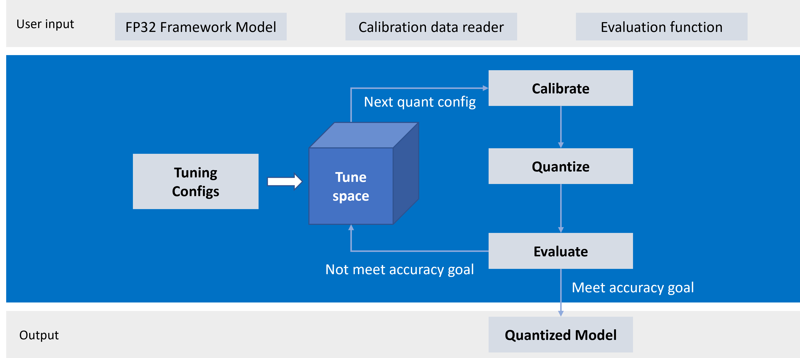

AutoTune
========================================

1. [Overview](#overview)
2. [How it Works](#how-it-works)
3. [Working with Autotune](#working-with-autotune)
4. [Get Started](#get-started)


## Overview

Neural Compressor aims to help users quickly deploy low-precision models by leveraging popular compression techniques, such as post-training quantization and weight-only quantization algorithms. Despite having a variety of these algorithms, finding the appropriate configuration for a model can be difficult and time-consuming. To address this, we built the `autotune` module which identifies the best algorithm configuration for models to achieve optimal performance under the certain accuracy criteria. This module allows users to easily use predefined tuning recipes and customize the tuning space as needed.

## How it Works

The autotune module constructs the tuning space according to the pre-defined tuning set or users' tuning set. It iterates the tuning space and applies the configuration on given float model then records and compares its evaluation result with the baseline. The tuning process stops when meeting the exit policy.
The workflow is as below:

<a target="_blank" href="imgs/workflow.png">
  
</a>


## Working with Autotune

The `autotune` API can be used across all algorithms supported by Neural Compressor. It accepts three primary arguments: `model_input`, `tune_config`, and `eval_fn`.

The `TuningConfig` class defines the tuning process, including the tuning space, order, and exit policy.

- Define the tuning space

  User can define the tuning space by setting `config_set` with an algorithm configuration or a set of configurations.
  ```python
  # Use the default tuning space
  config_set = config.get_woq_tuning_config()

  # Customize the tuning space with one algorithm configurations
  config_set = config.RTNConfig(weight_sym=False, weight_group_size=[32, 64])

  # Customize the tuning space with two algorithm configurations
  config_set = [
    config.RTNConfig(weight_sym=False, weight_group_size=32),
    config.GPTQConfig(weight_group_size=128, weight_sym=False),
  ]
  ```

- Define the tuning order

  The tuning order determines how the process traverses the tuning space and samples configurations. Users can customize it by configuring the `sampler`. Currently, we provide the [`default_sampler`](https://github.com/onnx/neural-compressor/blob/main/onnx_neural_compressor/quantization/tuning.py#L210), which samples configurations sequentially, always in the same order.

- Define the exit policy

  The exit policy includes two components: accuracy goal (`tolerable_loss`) and the allowed number of trials (`max_trials`). The tuning process will stop when either condition is met.

## Get Started
The example below demonstrates how to autotune a ONNX model on four `RTNConfig` configurations.

```python
from onnx_neural_compressor.quantization import config, tuning


def eval_fn(model) -> float:
    return ...


tune_config = tuning.TuningConfig(
    config_set=config.RTNConfig(
        weight_sym=[False, True],
        weight_group_size=[32, 128]
    ),
    tolerable_loss=0.2,
    max_trials=10,
)
q_model = tuning.autotune(model, tune_config=tune_config, eval_fn=eval_fn)
```